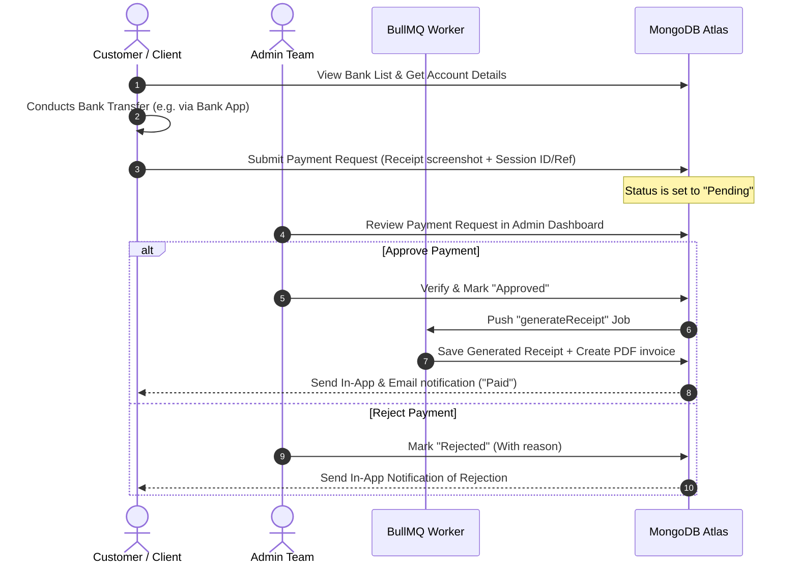

# Giant Multi-Company Platform: Master Planning & Setup Blueprint

Welcome to the central blueprint for the giant multi-company platform. This workspace contains the architecture, database schema, development steps, and deployment strategies for building both the Next.js web application and the Expo mobile application.

The platform coordinates operations for six business units:
1. **Academy Module:** Programming education, videos, live classes, assignments, and certificates.
2. **Software Agency Module:** Client project requesting, milestones tracking, payments, and PM dashboard.
3. **Maintenance Module:** App maintenance contracts, bug reporting, support tickets, and service-level agreements (SLAs).
4. **Printing & Graphic Design Module:** Printing orders, flyer/ID card/poster designs, price quotes, and receipt uploads.
5. **CS Student Projects Module:** Requesting computer science thesis/project proposals, document drafts, and code verification.
6. **Solar & Electrician Module:** Quotation request, task assignments for home wiring, solar installation, and repair.

---

## 📂 Documentation Navigator

We have mapped the entire system architecture in details in the `./docs/` folder:

* 🗄️ **[Database Architecture (docs/db.md)](file:///c:/Users/user/Downloads/kennykentola-multi-company/docs/db.md):** Complete database collection schemas, relational structures, indexes, and Role-Based Access Control (RBAC) permissions.
* ⚙️ **[System Architecture (docs/architecture.md)](file:///c:/Users/user/Downloads/kennykentola-multi-company/docs/architecture.md):** Monorepo directory structure, Express endpoint layouts, Socket.io real-time chat gateways, and the Tailwind CSS Glassmorphism design tokens.
* 🚀 **[Deployment Guide (docs/deployment.md)](file:///c:/Users/user/Downloads/kennykentola-multi-company/docs/deployment.md):** Detailed server setup for Render (Backend), Vercel (Frontend), MongoDB Atlas (Database), Upstash (Redis Cache & Queue), security middleware, and environment configurations.
* 📈 **[Future Feature Expansion (docs/features.md)](file:///c:/Users/user/Downloads/kennykentola-multi-company/docs/features.md):** Process guidelines, templates, and technical steps to safely introduce new codebase features later without regressions.
* 🔧 **[Corrections & Debugging Log (docs/corrections.md)](file:///c:/Users/user/Downloads/kennykentola-multi-company/docs/corrections.md):** Reference log tracking common platform bugs, pitfalls, and their exact solutions to prevent repeating past errors.

---

## 🚦 Manual Bank Transfer & Receipt Flow

Since the project starts in Nigeria using manual transfers, the payment system follows this strict verification cycle:

---

## 🛠️ Execution Checklist

This checklist tracks the development phases:

- [ ] **Phase 1: Setup & Monorepo Initialization**
  - Initialize the root workspaces (api, web, mobile, shared)
  - Configure ESLint, TypeScript, and Tailwind tokens
- [ ] **Phase 2: Database and API Layer**
  - Implement Mongoose Schemas & index optimizations
  - Set up JWT session controls (Access/Refresh token rotation)
- [ ] **Phase 3: Real-Time Communication Services**
  - Configure Socket.io connection handshakes and conversation rooms
  - Set up BullMQ for generating PDFs and queueing jobs
- [ ] **Phase 4: Next.js Website & Client Dashboards**
  - Integrate Shadcn components with custom glassmorphism styles
  - Build landing page hero and service cards
- [ ] **Phase 5: Expo Mobile Application**
  - Build bottom navigation routing (Home, Services, Academy, Messages, Profile)
  - Set up screen layouts for Android and iOS
- [ ] **Phase 6: Admin Analytics Panel & Finance CRM**
  - Create manual verification queues and payment logs
  - Generate automated PDF receipts

---

## 📝 Change Log & Future Extensions

Use this section to track new features and configuration adjustments made during the execution cycle:

### [2026-06-05] Portal Split and Appwrite Init Update
- Added a root-level `npm run init:appwrite` script for Appwrite database setup.
- Linked Appwrite initialization into API startup so Academy collections and seed content are ensured on launch.
- Added clearer portal entry points for Academy, Printing, and Project/App Build workflows.

### [2026-06-05] initial Blueprint Commit
- Designed schemas for MongoDB Atlas, Upstash Redis, Express controllers, and Next.js/Expo routers.
- Defined manual bank receipt approval states.
- Created `db.md`, `deployment.md`, and `architecture.md` inside `docs/`.
