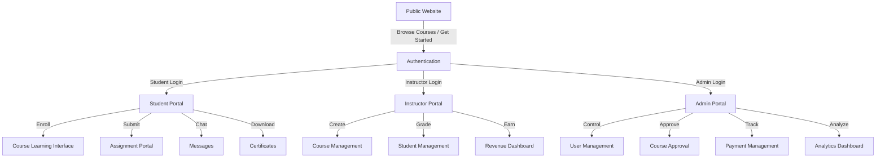

# 📚 Academy Module — Complete Vision & Portal Structure

> **Reference Document** — This file outlines the full architecture, page layouts, features, and user flows for the KennyKentola Programming Academy (LMS). Revisit this document during each sprint to ensure alignment with the original vision.

---

## Task Done

- [x] Added `npm run init:appwrite` and linked Appwrite initialization into API startup.
- [x] Separated the student experience into clearer portal entry points for Academy, Printing, and Project/App Build requests.
- [x] Updated registration and dashboard entry screens to reflect portal-specific access.

## Portal Architecture Overview



---

## 1. Public Website (Landing)

This is where visitors land **before** registration. It must convert visitors into students.

### Navigation Bar

| Item | Route | Notes |
|------|-------|-------|
| Logo | `/` | KennyKentola brand |
| Home | `/` | Landing hero |
| Courses | `/courses` or `/#courses` | Public course catalog |
| Bootcamps | `/bootcamps` | Intensive programs |
| Pricing | `/pricing` or `/#pricing` | Plan comparison |
| About | `/about` | Company story |
| Contact | `/contact` | Contact form |
| Login | `/login` | Auth page |
| Get Started | `/register` | CTA button (gradient) |

### Homepage Layout

#### Hero Section
```
┌─────────────────────────────────────────────────────────┐
│                                                         │
│   Become a Professional Developer                       │
│                                                         │
│   Learn Frontend, Backend, Mobile Development,          │
│   UI/UX Design, Data Analysis                           │
│                                                         │
│   [ Start Learning ]   [ Browse Courses ]               │
│                                                         │
└─────────────────────────────────────────────────────────┘
```

#### Statistics Bar
| Metric | Value |
|--------|-------|
| Students | 500+ |
| Courses | 20+ |
| Instructors | 10+ |
| Completion Rate | 95% |

#### Popular Courses Section (Card Grid)
- React Masterclass
- Python Development
- Django Backend
- UI/UX Design
- Data Analysis

Each card shows: **Cover Image**, **Title**, **Instructor**, **Price**, **Rating**, **Enroll CTA**

#### Student Testimonials
- Student photo + name
- Course completed
- Star rating
- Review text

#### Call To Action Footer
```
┌─────────────────────────────────────────────┐
│   Start Learning Today                      │
│   Join 500+ students building their future  │
│   [ Get Started Free ]                      │
└─────────────────────────────────────────────┘
```

---

## 2. Authentication

Single Sign-On for all portals (Student, Instructor, Admin).

### Registration Form Fields

| Field | Type | Required |
|-------|------|----------|
| First Name | text | ✅ |
| Middle Name | text | ❌ |
| Last Name | text | ✅ |
| Email | email | ✅ |
| Phone Number | tel | ✅ |
| Password | password | ✅ |
| Confirm Password | password | ✅ |

### Buttons
- **Register** (primary)
- **Continue with Google** (OAuth)

### Login Form
- Email
- Password
- Remember Me (checkbox)
- Forgot Password (link)
- Login (button)
- Continue with Google (OAuth)

---

## 3. Student Portal

**Route:** `/student/dashboard`

### Student Sidebar Navigation

| Nav Item | Route | Icon |
|----------|-------|------|
| Dashboard | `/student/dashboard` | LayoutDashboard |
| My Courses | `/student/courses` | BookOpen |
| Assignments | `/student/assignments` | FileCheck |
| Certificates | `/student/certificates` | Award |
| Community | `/student/community` | Users |
| Messages | `/student/messages` | MessageSquare |
| Payments | `/student/payments` | CreditCard |
| Profile | `/student/profile` | User |
| Settings | `/student/settings` | Settings |

### Student Dashboard Layout

```
┌──────────────────────────────────────────────────────────┐
│  Hello Ademola 👋                                        │
├──────────┬──────────┬──────────┬─────────────────────────┤
│ Enrolled │Completed │ Certs    │ Assignments Pending     │
│    4     │    2     │   2      │        3                │
├──────────┴──────────┴──────────┴─────────────────────────┤
│                                                          │
│  Continue Learning                                       │
│  ┌────────────────────────────────────────────┐          │
│  │ React Masterclass           75% ████████░░ │          │
│  │                          [ Continue ]      │          │
│  └────────────────────────────────────────────┘          │
│                                                          │
│  Upcoming Activities                                     │
│  • Assignment Due — React Hooks Exercise (2 days)        │
│  • Live Session — Django REST APIs (Tomorrow 2pm)        │
│  • New Lesson — Node.js Authentication                   │
│                                                          │
└──────────────────────────────────────────────────────────┘
```

### My Courses Page

Grid layout of enrolled course cards:

```
┌──────────────────┐  ┌──────────────────┐
│  React Masterclass│  │ Node.js Master   │
│                  │  │                  │
│  75% Complete    │  │  45% Complete    │
│  [ Continue ]    │  │  [ Continue ]    │
└──────────────────┘  └──────────────────┘
```

Each card shows:
- Course cover image
- Title
- Progress bar (percentage)
- Continue button
- Last accessed date

### Course Learning Interface ⭐ (Most Important Screen)

```
┌─────────────────────────────────────────────────────────────┐
│  Sidebar (Collapsible)           │   Main Content Area      │
│                                  │                          │
│  Course Modules                  │  ┌──────────────────────┐│
│                                  │  │                      ││
│  ✅ 1. Introduction              │  │   Video Player       ││
│  ✅ 2. HTML Basics               │  │   (16:9 ratio)       ││
│  ✅ 3. CSS Fundamentals          │  │                      ││
│  🔵 4. JavaScript                │  └──────────────────────┘│
│     └─ 4.1 Variables             │                          │
│     └─ 4.2 Functions  ◄ current  │  Lesson Title            │
│     └─ 4.3 DOM                   │                          │
│  🔒 5. React                     │  ┌──── Tab Bar ─────────┐│
│  🔒 6. State Management          │  │ Notes │ Resources │   ││
│                                  │  │ Assignment │ Discussion│
│                                  │  └──────────────────────┘│
│                                  │                          │
│                                  │  Lesson content / notes  │
│                                  │  rendered here...        │
│                                  │                          │
│                                  │  ┌──────────────────────┐│
│                                  │  │ ◄ Previous │ Next ►  ││
│                                  │  └──────────────────────┘│
└──────────────────────────────────────────────────────────────┘
```

**Key Features:**
- Sidebar shows all modules with completion status (✅ done, 🔵 current, 🔒 locked)
- Video player with playback controls
- Tabbed content below video: **Notes**, **Resources**, **Assignment**, **Discussion**
- Bottom navigation: Previous Lesson / Next Lesson
- Auto-mark lesson as complete on video finish
- Bookmarking / note-taking

### Assignment Portal

```
┌─────────────────────────────────────────────────┐
│  Assignment Title                               │
│                                                 │
│  Instructions:                                  │
│  Build a responsive landing page using React... │
│                                                 │
│  Due Date: June 15, 2026                        │
│  Max Points: 100                                │
│                                                 │
│  ┌──── Submission Form ────────────────────────┐│
│  │ GitHub URL:  [________________________]     ││
│  │ Live URL:    [________________________]     ││
│  │ Upload Files: [ Drag & Drop / Browse ]      ││
│  │                                             ││
│  │ Notes to Instructor:                        ││
│  │ [_______________________________________]   ││
│  │                                             ││
│  │              [ Submit Assignment ]          ││
│  └─────────────────────────────────────────────┘│
└─────────────────────────────────────────────────┘
```

### Certificates Portal

```
┌──────────────────────────────────────────────────┐
│  My Certificates                                 │
│                                                  │
│  ┌────────────────────────────────────┐          │
│  │  🏆 React Masterclass              │          │
│  │  Completed: May 2026               │          │
│  │  Grade: A (92%)                     │          │
│  │  [ Download Certificate ] [ Share ] │          │
│  └────────────────────────────────────┘          │
│                                                  │
│  ┌────────────────────────────────────┐          │
│  │  🏆 Python Development             │          │
│  │  Completed: April 2026             │          │
│  │  Grade: A+ (97%)                    │          │
│  │  [ Download Certificate ] [ Share ] │          │
│  └────────────────────────────────────┘          │
└──────────────────────────────────────────────────┘
```

### Community Portal

Mini social network for students.

**Features:**
- Ask Questions
- Share Projects
- Comment on posts
- Like / Upvote posts
- Tag by course / topic

```
┌──────────────────────────────────────────────────┐
│  Community Feed                                  │
│                                                  │
│  [ Create Post ]                                 │
│                                                  │
│  ┌────────────────────────────────────┐          │
│  │ 🧑 Ademola • React Masterclass    │          │
│  │ "Check out my React project!"      │          │
│  │ [screenshot.png]                   │          │
│  │ ❤ 12  💬 5  🔗 Share               │          │
│  └────────────────────────────────────┘          │
│                                                  │
│  ┌────────────────────────────────────┐          │
│  │ 🧑 Fatima • Django Backend         │          │
│  │ "Need help with Django migrations" │          │
│  │ ❤ 3   💬 8  🔗 Share               │          │
│  └────────────────────────────────────┘          │
└──────────────────────────────────────────────────┘
```

### Messages Portal

Real-time chat system.

```
┌───────────────────────────────────────────────────┐
│  Contacts          │  Chat Window                 │
│                    │                              │
│  🟢 Support        │  Instructor — React Class    │
│  🟢 Instructor     │                              │
│  ⚪ Mentor          │  Student:                    │
│  ⚪ Admin           │  "I need help with           │
│                    │   Assignment 2"              │
│                    │                              │
│                    │  Instructor:                 │
│                    │  "Let's review it.           │
│                    │   Share your screen."        │
│                    │                              │
│                    │  [Type a message...]  [Send] │
└───────────────────────────────────────────────────┘
```

### Profile Portal

```
┌─────────────────────────────────────────────────┐
│  Student Profile                                │
│                                                 │
│  ┌──────┐  Ademola Femi                         │
│  │ 📷   │  ademola@email.com                    │
│  │Avatar│  +234 801 234 5678                    │
│  └──────┘                                       │
│                                                 │
│  Bio: Full-stack developer in training...       │
│                                                 │
│  Skills: React, Node.js, Python                 │
│                                                 │
│  GitHub:   github.com/ademola                   │
│  LinkedIn: linkedin.com/in/ademola              │
│                                                 │
│  [ Edit Profile ]                               │
└─────────────────────────────────────────────────┘
```

---

## 4. Instructor Portal

**Route:** `/instructor/dashboard`

### Instructor Sidebar Navigation

| Nav Item | Route | Icon |
|----------|-------|------|
| Dashboard | `/instructor/dashboard` | LayoutDashboard |
| My Courses | `/instructor/courses` | BookOpen |
| Lessons | `/instructor/lessons` | Video |
| Assignments | `/instructor/assignments` | FileCheck |
| Students | `/instructor/students` | Users |
| Revenue | `/instructor/revenue` | DollarSign |
| Messages | `/instructor/messages` | MessageSquare |
| Settings | `/instructor/settings` | Settings |

### Instructor Dashboard

```
┌──────────┬──────────┬──────────┬─────────────────┐
│ Total    │ Active   │ Revenue  │ Pending         │
│ Students │ Courses  │ ₦450K    │ Reviews: 8      │
│   120    │    5     │          │                 │
├──────────┴──────────┴──────────┴─────────────────┤
│                                                  │
│  Recent Activity                                 │
│  • 3 new enrollments today                       │
│  • 8 assignments awaiting review                 │
│  • Live session in 2 hours                       │
│                                                  │
│  Quick Actions                                   │
│  [ Create Course ] [ Schedule Live Session ]     │
└──────────────────────────────────────────────────┘
```

### Course Management

Instructors can create and manage:

| Entity | Actions |
|--------|---------|
| Course | Create, Edit, Publish, Archive |
| Module | Add, Reorder, Delete |
| Lesson | Add, Upload Video, Add Resources |
| Quiz | Create questions, Set passing score |
| Assignment | Create, Set deadline, Set points |

**Course Builder Flow:**
```
Create Course
    ↓
Add Course Details (title, description, cover, price, category)
    ↓
+ Add Module (e.g. "Introduction")
    ↓
    + Add Lesson (title, video upload, notes, resources)
    + Add Lesson ...
    ↓
+ Add Module (e.g. "Advanced Topics")
    ↓
    + Add Lesson ...
    + Add Quiz
    + Add Assignment
    ↓
Publish Course
```

### Student Management

Instructor sees per-student:

| Column | Data |
|--------|------|
| Student Name | Full name + avatar |
| Course | Which course enrolled |
| Progress | Percentage complete |
| Assignment Status | Submitted / Pending / Graded |
| Certificate Status | Eligible / Issued / Not Yet |
| Last Active | Timestamp |

---

## 5. Admin Portal

**Route:** `/admin/dashboard`

The control center for the entire academy.

### Admin Sidebar Navigation

| Nav Item | Route | Icon |
|----------|-------|------|
| Overview | `/admin` | Shield |
| Users | `/admin/users` | Users |
| → Students | `/admin/users?role=Student` | GraduationCap |
| → Instructors | `/admin/users?role=Instructor` | UserCheck |
| Courses | `/admin/courses` | BookOpen |
| Payments | `/admin/payments` | CreditCard |
| Certificates | `/admin/certificates` | Award |
| Community | `/admin/community` | MessageCircle |
| Analytics | `/admin/analytics` | BarChart3 |
| Settings | `/admin/settings` | Settings |

### Admin Dashboard KPI Cards

| Metric | Icon |
|--------|------|
| Total Students | Users |
| Total Courses | BookOpen |
| Total Revenue | DollarSign |
| Certificates Issued | Award |
| Pending Assignments | FileCheck |

### Admin Charts
- Monthly Revenue (bar chart)
- Student Growth (line chart)
- Course Enrollment (pie chart)
- Completion Rate (gauge)

### User Management Features
- Search users by name / email / role
- Assign roles (Student → Instructor → Admin)
- Deactivate / Reactivate accounts
- Reset passwords
- View user activity logs

### Course Management Features
- Approve instructor-submitted courses
- Edit any course details
- Delete / Archive courses
- Feature courses on homepage
- Set pricing overrides

### Payment Management
- View all transactions
- Process refunds
- Generate invoices
- Export financial reports (CSV)
- Revenue splits (Instructor vs Platform)

---

## 6. Mobile Design (React Native / Expo)

### Bottom Tab Navigation

| Tab | Icon | Screen |
|-----|------|--------|
| Home | Home | Dashboard overview |
| Courses | BookOpen | Course list + learning |
| Community | Users | Social feed |
| Messages | MessageSquare | Chat |
| Profile | User | Settings + profile |

### Mobile-Specific Considerations
- Video player must support **picture-in-picture** mode
- Offline lesson download support (future)
- Push notifications for:
  - Assignment deadlines
  - New lessons published
  - Live session reminders
  - Message notifications
- Pull-to-refresh on feeds
- Bottom sheet modals for quick actions

---

## Database Collections Required

| Collection | Purpose |
|------------|---------|
| `users_profile` | All user data + role + purpose |
| `courses` | Course metadata |
| `modules` | Course section groupings |
| `lessons` | Individual lesson content |
| `enrollments` | Student ↔ Course relationships |
| `lesson_progress` | Track which lessons completed |
| `assignments` | Assignment definitions |
| `submissions` | Student assignment submissions |
| `certificates` | Issued certificates |
| `community_posts` | Social feed posts |
| `community_comments` | Comments on posts |
| `live_classes` | Scheduled live sessions |
| `quizzes` | Quiz questions + answers |
| `quiz_attempts` | Student quiz results |
| `instructor_payouts` | Revenue tracking |

---

## Implementation Priority Order

> [!IMPORTANT]
> Build in this order to ensure each layer depends on the previous one.

1. **Auth + Role-based routing** (Student / Instructor / Admin separation)
2. **Course catalog** (public browsing + enrollment)
3. **Course learning interface** (video player + lesson navigation)
4. **Assignment submission + grading**
5. **Certificate generation**
6. **Instructor course builder**
7. **Community feed**
8. **Real-time messaging**
9. **Analytics dashboards**
10. **Mobile app integration**

---

## Route Structure Summary

```
/                              → Public landing
/courses                       → Public course catalog
/courses/:courseId             → Public course detail
/login                         → Authentication
/register                      → Registration

/student/dashboard             → Student overview
/student/courses               → Enrolled courses grid
/student/courses/:courseId     → Course learning interface
/student/assignments           → All assignments
/student/certificates          → Downloaded certs
/student/community             → Social feed
/student/messages              → Chat
/student/payments              → Payment history
/student/profile               → Edit profile
/student/settings              → Preferences

/instructor/dashboard          → Instructor overview
/instructor/courses            → My courses (CRUD)
/instructor/courses/:id/edit   → Course builder
/instructor/lessons            → Lesson management
/instructor/assignments        → Grading queue
/instructor/students           → Student progress
/instructor/revenue            → Earnings
/instructor/messages           → Chat
/instructor/settings           → Preferences

/admin/dashboard               → Admin overview
/admin/users                   → User management
/admin/courses                 → Course approval
/admin/payments                → Financial management
/admin/certificates            → Certificate management
/admin/community               → Moderation
/admin/analytics               → Charts + reports
/admin/settings                → Platform config
```

---

> [!NOTE]
> This document is a **living reference**. Update it as features are built, modified, or deprioritized. Each section maps directly to a sprint deliverable.
