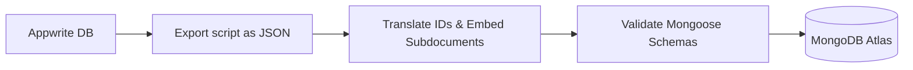

# Database System Design (`db.md`)

This document outlines our two-stage database strategy:
1. **Phase 1 (Active): Appwrite DB** – Fast prototyping, built-in access controls, and integrated user auth.
2. **Phase 2 (Future): MongoDB Atlas Migration** – Highly scalable query engine and complex analytical aggregations.

---

## Part 1: Appwrite Database Design (Active Phase)

Appwrite DB does not support nested subdocuments. All subdocuments (e.g., project milestones, ticket messages) are modeled as separate collections with **Relationship Attributes** (one-to-many or many-to-one) or flattened.

### Appwrite Collections & Attributes

#### 1. Users Profile Collection (`users_profile`)
*Note: Appwrite Auth handles credentials separately. This collection stores extended profile data.*
- **Attributes:**
  - `userId` (String, key): Matches the Appwrite Auth UID.
  - `firstName` (String, size 100)
  - `lastName` (String, size 100)
  - `phoneNumber` (String, size 30, nullable)
  - `role` (String, size 50, default: `"Student"`): User role enum.
  - `avatarUrl` (String, size 500, nullable)
- **Permissions:**
  - Document Owner: Read/Write
  - Admins & Super Admins: Read/Write
  - Others: Read

#### 2. Courses (`courses`)
- **Attributes:**
  - `title` (String, size 255)
  - `description` (String, size 5000)
  - `instructorId` (String, size 50): ID of instructor user.
  - `coverImage` (String, size 500, nullable)
  - `price` (Float, min 0)
  - `isPublished` (Boolean, default: `false`)
- **Permissions:**
  - Admins & Instructors: Create/Read/Update/Delete
  - Any (Public): Read (only if `isPublished` is true)

#### 3. Lessons (`lessons`)
- **Attributes:**
  - `courseId` (String, size 50): Relationship (Many-to-One with `courses`).
  - `title` (String, size 255)
  - `content` (String, size 10000, nullable)
  - `videoUrl` (String, size 500, nullable)
  - `order` (Integer)
- **Permissions:**
  - Admins & Instructors: Create/Read/Update/Delete
  - Purchased Students: Read (verified via server-side function or check)

#### 4. Live Classes (`live_classes`)
- **Attributes:**
  - `courseId` (String, size 50): Relationship (Many-to-One with `courses`).
  - `title` (String, size 255)
  - `scheduledAt` (Datetime)
  - `durationMinutes` (Integer)
  - `meetingUrl` (String, size 1000)
  - `status` (String, default: `"scheduled"`): `scheduled`, `active`, `completed`

#### 5. Assignments (`assignments`)
- **Attributes:**
  - `courseId` (String, size 50): Relationship (Many-to-One with `courses`).
  - `title` (String, size 255)
  - `instructions` (String, size 5000)
  - `dueDate` (Datetime)
  - `maxPoints` (Integer, default: 100)

#### 6. Submissions (`submissions`)
- **Attributes:**
  - `assignmentId` (String, size 50): Relationship (Many-to-One with `assignments`).
  - `studentId` (String, size 50)
  - `fileUrls` (String, array, size 500): List of uploaded file URLs.
  - `studentNote` (String, size 1000, nullable)
  - `pointsAwarded` (Integer, nullable)
  - `feedback` (String, size 2000, nullable)
  - `status` (String, default: `"pending"`): `pending`, `graded`

#### 7. Certificates (`certificates`)
- **Attributes:**
  - `studentId` (String, size 50)
  - `courseId` (String, size 50)
  - `certificateNumber` (String, size 100)
  - `issuedAt` (Datetime)
  - `pdfUrl` (String, size 500)

#### 8. Projects (`projects`)
- **Attributes:**
  - `clientId` (String, size 50)
  - `title` (String, size 255)
  - `description` (String, size 5000)
  - `budget` (Float)
  - `status` (String, default: `"requested"`): `requested`, `estimation`, `in-progress`, `completed`, `cancelled`
  - `pmId` (String, size 50, nullable)
  - `developers` (String, array, size 50): List of Developer UIDs.
  - `designers` (String, array, size 50): List of Designer UIDs.

#### 9. Project Milestones (`project_milestones`)
- **Attributes:**
  - `projectId` (String, size 50): Relationship (Many-to-One with `projects`).
  - `title` (String, size 255)
  - `description` (String, size 1000, nullable)
  - `dueDate` (Datetime)
  - `status` (String, default: `"pending"`): `pending`, `completed`
  - `completedAt` (Datetime, nullable)

#### 10. Maintenance Contracts (`maintenance_contracts`)
- **Attributes:**
  - `clientId` (String, size 50)
  - `title` (String, size 255)
  - `description` (String, size 2000, nullable)
  - `status` (String, default: `"pending"`): `pending`, `active`, `expired`
  - `monthlyRetainer` (Float)
  - `billingCycle` (String, default: `"monthly"`): `monthly`, `quarterly`, `yearly`
  - `startDate` (Datetime)
  - `endDate` (Datetime)

#### 11. Tickets (`tickets`)
- **Attributes:**
  - `userId` (String, size 50)
  - `projectOrContractId` (String, size 50, nullable)
  - `subject` (String, size 255)
  - `description` (String, size 5000)
  - `priority` (String, default: `"medium"`): `low`, `medium`, `high`, `urgent`
  - `status` (String, default: `"open"`): `open`, `in-progress`, `resolved`, `closed`
  - `assignedTo` (String, size 50, nullable)

#### 12. Ticket Messages (`ticket_messages`)
- **Attributes:**
  - `ticketId` (String, size 50): Relationship (Many-to-One with `tickets`).
  - `senderId` (String, size 50)
  - `content` (String, size 4000)
  - `fileUrls` (String, array, size 500, nullable)
  - `sentAt` (Datetime)

#### 13. Print Orders (`print_orders`)
- **Attributes:**
  - `userId` (String, size 50)
  - `fileUrl` (String, size 500)
  - `fileType` (String, size 50)
  - `printingType` (String): `photocopy`, `book-printing`, `id-card`, `flyer`, `poster`, `invoice-design`
  - `colorMode` (String, default: `"mono"`): `mono`, `color`
  - `paperSize` (String, default: `"A4"`): `A4`, `A3`, `A5`, `custom`
  - `doubleSided` (Boolean, default: `false`)
  - `quantity` (Integer, default: 1)
  - `coverType` (String, size 100, nullable)
  - `status` (String, default: `"pending"`): `pending`, `quoting`, `paid`, `printing`, `completed`, `delivered`
  - `quotePrice` (Float, default: 0)
  - `shippingAddress` (String, size 500, nullable)
  - `paymentId` (String, size 50, nullable)

#### 14. Student Projects (`student_projects`)
- **Attributes:**
  - `studentId` (String, size 50)
  - `title` (String, size 255)
  - `description` (String, size 5000)
  - `status` (String, default: `"pending-proposal"`): `pending-proposal`, `proposal-approved`, `document-drafting`, `code-development`, `completed`
  - `assignedDeveloper` (String, size 50, nullable)
  - `price` (Float)
  - `proposalUrl` (String, size 500, nullable)
  - `documentationUrl` (String, size 500, nullable)
  - `sourceCodeUrl` (String, size 500, nullable)
  - `paymentId` (String, size 50, nullable)

#### 15. Solar Jobs (`solar_jobs`)
- **Attributes:**
  - `clientId` (String, size 50)
  - `jobType` (String): `solar-installation`, `electrical-repair`, `home-wiring`, `inverter-setup`
  - `description` (String, size 5000)
  - `status` (String, default: `"pending-quote"`): `pending-quote`, `quoted`, `paid`, `in-progress`, `completed`, `cancelled`
  - `assignedTechnicians` (String, array, size 50, nullable)
  - `quotePrice` (Float, default: 0)
  - `scheduledDate` (Datetime, nullable)
  - `address` (String, size 500)
  - `paymentId` (String, size 50, nullable)

#### 16. Bank Accounts (`bank_accounts`)
- **Attributes:**
  - `bankName` (String, size 100)
  - `accountName` (String, size 100)
  - `accountNumber` (String, size 50)
  - `isActive` (Boolean, default: `true`)

#### 17. Payments (`payments`)
- **Attributes:**
  - `userId` (String, size 50)
  - `type` (String): `course`, `agency_project`, `printing`, `solar_job`, `student_project`, `maintenance`
  - `referenceId` (String, size 50)
  - `bankAccountId` (String, size 50)
  - `amount` (Float)
  - `receiptImage` (String, size 500)
  - `referenceNumber` (String, size 100)
  - `status` (String, default: `"pending"`): `pending`, `verified`, `rejected`
  - `verifiedBy` (String, size 50, nullable)
  - `verifiedAt` (Datetime, nullable)
  - `rejectedReason` (String, size 1000, nullable)
  - `submittedAt` (Datetime)

#### 18. Receipts (`receipts`)
- **Attributes:**
  - `paymentId` (String, size 50)
  - `receiptNumber` (String, size 50)
  - `amount` (Float)
  - `paidBy` (String, size 255)
  - `paymentMethod` (String, default: `"Bank Transfer"`)
  - `date` (Datetime)
  - `pdfUrl` (String, size 500)

#### 19. Conversations & Messages (`conversations`, `messages`)
- **Conversations:**
  - `participants` (String, array, size 50)
  - `type` (String, default: `"direct"`): `direct`, `group`
  - `name` (String, size 100, nullable)
- **Messages:**
  - `conversationId` (String, size 50): Relationship (Many-to-One with `conversations`).
  - `senderId` (String, size 50)
  - `content` (String, size 4000)
  - `fileUrls` (String, array, size 500, nullable)
  - `readBy` (String, array, size 50, default: `[]`)
  - `createdAt` (Datetime)

---

## Part 2: MongoDB Schema Design (Future Phase)

During migration, collection data will be structured to utilize MongoDB's **embedded document arrays**, reducing the total collections count and simplifying querying.

```typescript
// Example: Unified Project Schema in MongoDB
const ProjectSchema = new Schema({
  clientId: { type: Schema.Types.ObjectId, ref: 'User', required: true },
  title: { type: String, required: true },
  description: { type: String },
  budget: { type: Number },
  status: { type: String, enum: ['requested', 'estimation', 'in-progress', 'completed', 'cancelled'] },
  pmId: { type: Schema.Types.ObjectId, ref: 'User' },
  developers: [{ type: Schema.Types.ObjectId, ref: 'User' }],
  designers: [{ type: Schema.Types.ObjectId, ref: 'User' }],
  
  // Appwrite relation project_milestones is embedded directly in MongoDB
  milestones: [{
    title: { type: String, required: true },
    description: { type: String },
    dueDate: { type: Date },
    status: { type: String, enum: ['pending', 'completed'], default: 'pending' },
    completedAt: { type: Date }
  }],
  
  files: [{
    name: String,
    url: String,
    uploadedBy: { type: Schema.Types.ObjectId, ref: 'User' },
    uploadedAt: { type: Date, default: Date.now }
  }]
}, { timestamps: true });
```

---

## Part 3: Appwrite-to-MongoDB Migration Strategy

When transitioning from Appwrite DB to MongoDB Atlas, we will execute a clean, multi-step migration script.



### Migration Script Pattern (Node.js)
```typescript
import { Client, Databases } from 'node-appwrite';
import mongoose from 'mongoose';
import { ProjectModel } from './models/Project';

const appwriteClient = new Client()
  .setEndpoint('https://cloud.appwrite.io/v1')
  .setProject(process.env.APPWRITE_PROJECT_ID!)
  .setKey(process.env.APPWRITE_API_KEY!);

const databases = new Databases(appwriteClient);

async function migrateProjects() {
  await mongoose.connect(process.env.MONGODB_URI!);
  
  // 1. Fetch flat projects and milestones from Appwrite
  const appwriteProjects = await databases.listDocuments('database_id', 'projects_collection_id');
  const appwriteMilestones = await databases.listDocuments('database_id', 'milestones_collection_id');

  console.log(`Migrating ${appwriteProjects.total} projects...`);

  // 2. Loop through and rebuild schemas
  for (const projectDoc of appwriteProjects.documents) {
    // Filter matching milestones
    const relatedMilestones = appwriteMilestones.documents
      .filter(m => m.projectId === projectDoc.$id)
      .map(m => ({
        title: m.title,
        description: m.description,
        dueDate: m.dueDate,
        status: m.status,
        completedAt: m.completedAt
      }));

    // 3. Write embedded document into MongoDB
    await ProjectModel.create({
      _id: projectDoc.$id, // Preserve ID to keep relations intact
      clientId: projectDoc.clientId,
      title: projectDoc.title,
      description: projectDoc.description,
      budget: projectDoc.budget,
      status: projectDoc.status,
      pmId: projectDoc.pmId,
      developers: projectDoc.developers,
      designers: projectDoc.designers,
      milestones: relatedMilestones
    });
  }
  
  console.log('Projects migration complete.');
}
```
